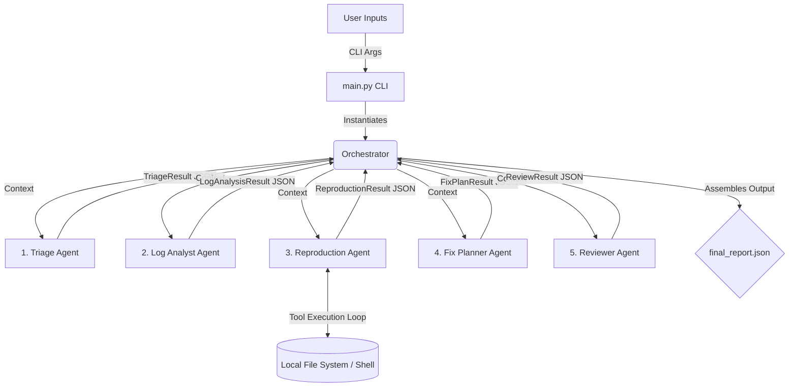

# AI Bug Report Multi-Agent System

This project is an automated bug investigation system that orchestrates multiple autonomous AI agents to ingest bug reports, analyze stack traces, dynamically write Reproduction scripts via executing python locally, and propose root-cause fixes.

## Approach: Provided Mini-Repo

The system is designed around a **"Provided Mini-Repo"** methodology. Rather than operating purely conceptually, the multi-agent pipeline is fed an actual, contained codebase where an intentionally introduced bug exists.
* **Small Codebase**: The orchestrator points exactly to a local target directory (`repo/`) containing the buggy application source.
* **Structured Inputs**: The system parses a user-provided Bug Report (`inputs/bug_report.md`—including steps to reproduce the issue) and corresponding Error Logs (`inputs/error_logs.txt`).
* **Active Reproduction Environment**: Utilizing local CLI tool integrations, the Agents actively write and run Python test scripts within this repository context to confirm the bug and validate failure scenarios locally before synthesizing a final patch plan.

## Tech Stack

* **Python 3.9+**: Core system language.
* **LLM Integration**: Uses the `openai` Python client to interface with LLMs (currently configured for a local Ollama instance with `llama3.2`, but adaptable to OpenAI endpoints or Gemini through its compatibility API).
* **Pydantic**: Enforces strict structured JSON schema outputs from the Agents.
* **python-dotenv**: Manages configuration and environment variables.
* **Local Tool Environment**: A sandboxed execution environment built using Python's `subprocess` and `os` modules to provide programatic file operations and run reproduction scripts locally.

## Project Structure

```text
ai-bug-report/
├── .env                    # Environment variables (create from .env.template)
├── README.md               # Project documentation
├── requirements.txt        # Python dependencies
├── main.py                 # CLI entry point to run the system
├── final_report.json       # Generated output from the multi-agent pipeline
├── repo/                   # Target repository where the bug resides
│   └── (source files)
├── inputs/                 # Initial input files for the run
│   ├── bug_report.md       # User-provided bug description
│   └── error_logs.txt      # Attached stack traces or server logs
└── system/
    ├── __init__.py
    ├── agents.py           # Defines UnifiedAgent and subclassed specialized agents
    ├── models.py           # Pydantic schemas for structured JSON output
    ├── orchestrator.py     # State machine running the agents in sequence
    └── tools.py            # Local python tools (read, write, search, run)
```

## Setup and Run Instructions

### 1. Prerequisites
* Python 3.9+ installed
* A local LLM runner such as Ollama running on `http://localhost:11434` (or you can reconfigure the base URL and API keys in the code).

### 2. Environment Setup
Creating a virtual environment is highly recommended.

**On Windows:**
```powershell
python -m venv venv
venv\Scripts\activate
pip install -r requirements.txt
```

**On Linux / macOS:**
```bash
python3 -m venv venv
source venv/bin/activate
pip install -r requirements.txt
```

### 3. Application Configuration
Copy the `.env.template` file to `.env` to set up your environment variables (like API keys or base URLs, if you adjust the agent configuration).
```bash
cp .env.template .env
```
Ensure your target model instance is active locally so that the agents are reachable.

### 4. Running the System
Use the `main.py` CLI to trigger the multi-agent orchestration. You must provide the target repository path, the bug report file, and the corresponding log file.

```bash
python main.py --repo repo --report inputs/bug_report.md --logs inputs/error_logs.txt
```

If successful, the system's aggregated findings will be saved to `final_report.json` in the root directory.

## The Agents

The system passes context through five specialized autonomous agents:

1. **Triage Agent**: Extracts key symptoms, expected vs. actual behavior, and environment details. It prioritizes initial hypotheses purely from reading the bug report and logs.
2. **Log Analyst Agent**: Searches logs for stack traces, error signatures, frequency, and correlation with deployments. It identifies anomalous patterns to narrow down the domain of the root cause.
3. **Reproduction Agent**: The action-oriented agent. Provided with programmatic tools via `system/tools.py`, it constructs a minimal python repro script, writes it to the local file system (`repro.py`), and executes it to safely confirm the bug exists exactly as reported.
4. **Fix Planner Agent**: Analyzes the log evidence together with the output from the Reproduction Agent. It proposes a firm root-cause hypothesis, formulates a patch approach, identifies the implicated files, and specifies a verification plan.
5. **Reviewer Agent**: Acts as the devil's advocate. It challenges weak assumptions, verifies that the proposed plan is fundamentally safe, confirms the isolation of the reproduction script, and flags edge cases.

## Workflow

1. **System Initialization**: The user invokes `main.py` via CLI, passing the target repository path, the bug report markdown, and the raw system logs. The `SystemOrchestrator` is spun up to manage state.
2. **Phase 1 - Triage & Log Analysis**: The `TriageAgent` digests the human-written bug report to define symptoms and expected behaviors. Its structured output is handed to the `LogAnalystAgent`, which correlates those symptoms with specific stack traces and anomaly signatures found in the text logs.
3. **Phase 2 - Active Reproduction**: Equipped with the analytic context and sandboxed tool-calling capabilities (`read_file`, `search_files`, `write_test_script`, `run_test_script`), the `ReproductionAgent` navigates the `repo/` context and drafts a minimal `repro.py` script. The orchestrator physically executes this code via `subprocess` and pipes the terminal output terminal back to the agent until the bug is perfectly replicated.
4. **Phase 3 - Root Cause & Planning**: The `FixPlannerAgent` ingests the confirmed execution logs from the reproduction testing and proposes a targeted code patch, specifying exact file modifications and a localized root-cause hypothesis.
5. **Phase 4 - Review & Compilation**: The `ReviewerAgent` criticizes the final patch for edge cases and safety. The orchestrator then safely serializes the complete analytical journey into `final_report.json`.

## System Architecture


